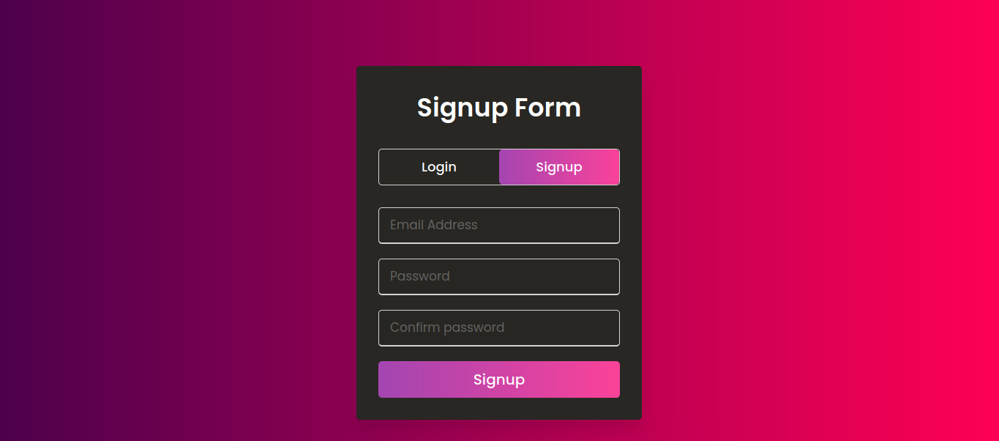

# Login-form
> A simple login website built with node and express

# :closed_lock_with_key: Dependencies
- `express` 
- `nodemon`
- `ejs`
- `mongoose`
- `express-validator`
- `connect-mongodb-session`

The system has following functionalities:
- MVC pattern
- responsive UI
- proper Form validation
- Database integrated
- reusable code format

# Installation 
- clone the project
- create a file in the folder named nodemon.json
- Edit the nodemon.json file in folloowing way

```
{
  "env": {
    "MONGO_USER": "your_mongodb_username",
    "MONGO_PASSWORD": "your_mongodb_password",
    "MONGO_DEFAULT_DATABASE": "your_mongodb_database_name"
  }
}

```
- run `npm install`
- run `npm start` to run the project
- search in the brower using `localhost:3000`


# Screenshots
## Home Page


## User Dasboard


 
